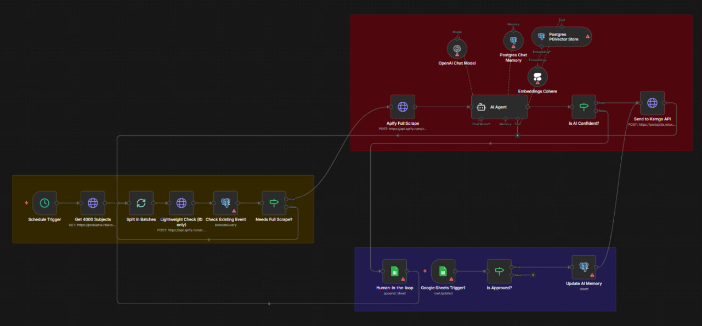

# Kamgo FB Sourcing (KGFBS) – Automatizovaný Scraping a Kategorizácia

  

## 🏗️ Architektúra riešenia (Workflow Design)
Systém je navrhnutý ako uzatvorený cyklus spätnej väzby, ktorý kombinuje vysoký výkon s prísnou nákladovou efektivitou. Proces je rozdelený do dvoch hlavných fáz:

### 1. Hlavný spracovateľský cyklus (Sourcing & AI)
* **Iteratívne dávkovanie**: Systém načítava 4 000 subjektov a spracováva ich v dávkach po 50 záznamov, aby sa zabezpečila stabilita a predišlo preťaženiu pamäte.
* **Dvojstupňová validácia (Cost-Efficiency)**:
    * **Lightweight Check**: Najprv sa overuje iba `fbId` a čas začiatku `startAt`.
    * **Postgres Filter**: Plnohodnotný scraping (Apify) sa spustí len vtedy, ak ide o úplne nové podujatie alebo zmenu termínu, čo šetrí náklady na externé služby.
* **Autonómny AI Agent (LangChain)**:
    * Využíva model **GPT-4o-mini** na inteligentnú kategorizáciu podujatí.
    * **Sémantická pamäť**: Agent je napojený na **Postgres PGVector Store**, odkiaľ si v reálnom čase sťahuje relevantné historické príklady pre presnejšie rozhodovanie.

### 2. Human-in-the-loop & Feedback Loop (Učenie sa)
* **Confidence Split**: Ak je miera istoty AI nižšia ako 80 % (0.8), záznam sa neodosiela do produkcie, ale automaticky sa zapíše do Google Sheets na manuálnu kontrolu.
* **Aktívne učenie (Feedback Loop)**: Akonáhle moderátor v Google Sheets zmení kategóriu z `Unknown` na konkrétnu hodnotu, spustí sa automatický proces:
    1.  Dáta sa odošlú do produkčného **Kamgo API**.
    2.  Správna klasifikácia sa uloží do vektorovej databázy cez **Cohere Embeddings**.
    3.  Pri ďalšom behu už AI Agent túto opravu pozná a aplikuje ju na podobné prípady.

## 🛠️ Použité technológie
* **n8n (LangChain Engine)**: Hlavný nástroj na orchestráciu AI agentov, pamäte a nástrojov.
* **OpenAI (GPT-4o-mini)**: Jadro pre logické uvažovanie a kategorizáciu.
* **PostgreSQL + PGVector**: Ukladanie dát o podujatiach a dlhodobá sémantická pamäť agenta.
* **Cohere**: Generovanie vektorových embeddingov pre efektívne vyhľadávanie v pamäti.
* **Google Sheets API**: Používateľské rozhranie pre moderátora (Admin Panel).
* **Apify**: Profesionálny nástroj na scraping dát z Facebook Events.

## 🚀 Hlavné výhody riešenia
* **Škálovateľnosť**: Vektorové vyhľadávanie umožňuje systému učiť sa z tisícov príkladov bez lineárneho nárastu nákladov na tokeny.
* **Nízke prevádzkové náklady**: Vďaka predbežnej kontrole ID v Postgres sa eliminuje väčšina zbytočných volaní platených scraping služieb.
* **Vysoká presnosť**: Kombinácia AI s ľudským dohľadom (Human-in-the-loop) zabezpečuje 100% správnosť dát v produkcii.

