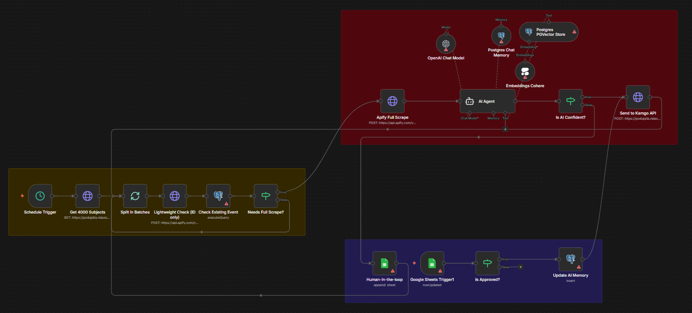

# Kamgo FB Sourcing (KGFBS) – Automatizovaný Scraping a Kategorizácia

  

## 📋 Prehľad projektu
Tento repozitár obsahuje návrh a proof-of-concept systému pre subprojekt **Kamgo (KGFBS)**. Cieľom systému je zabezpečiť prísun vytvorených alebo upravených podujatí publikovaných na definovaných FB stránkach. Systém automatizuje zber dát, ich inteligentnú kategorizáciu pomocou AI a následnú distribúciu cez Kamgo API.

## 🏗️ Architektúra riešenia (n8n Workflow)
Riešenie je postavené na platforme **n8n**, ktorá zabezpečuje orchestráciu celého procesu. Systém je navrhnutý s prioritou na **nákladovú efektivitu (cost-efficiency)**.

### Kľúčové fázy procesu:
1.  **Zber zdrojov:** Načítanie zoznamu 4 000 sledovaných subjektov z API s využitím autorizačného tokenu.
2.  **Inkrementálny scraping (Lightweight Check):** * Systém najprv kontroluje unikátne `fbId` a čas začiatku `startAt`.
    * Plnohodnotný scraping sa spustí len vtedy, ak je zistená zmena alebo nové podujatie, čo výrazne šetrí náklady na scraping služby.
3.  **AI Kategorizácia:** * Zozbierané dáta (názov, popis, FB tagy) sú spracované pomocou AI.
    * AI navrhne zaradenie do stromu kategórií Kamgo (napr. Pre deti, Mládež, Hudba, Pohyb a šport...).
4.  **Human-in-the-loop:** * Proces kategorizácie zahŕňa spätnú väzbu od človeka.
    * Systém sa učí z ľudských vstupov pre neustále zlepšovanie presnosti.

## 🛠️ Použité technológie
* **n8n:** Hlavný nástroj pre automatizáciu a prepojenie služieb.
* **Python:** Skripty pre logiku porovnávania duplicít a validáciu polí.
* **OpenAI API:** Kategorizácia podujatí na základe textovej analýzy.
* **PostgreSQL:** Databáza pre uchovávanie štruktúrovaných dát o podujatiach.

## 🚀 Dátový model (Fields Mapping)
Systém spracováva všetky povinné a voliteľné atribúty podľa špecifikácie:
* **Povinné:** fbId, fbUrl, name, city, startAt.
* **Doplnkové:** description, placeName, street, imageUrl, category, ticketUrl.

---

